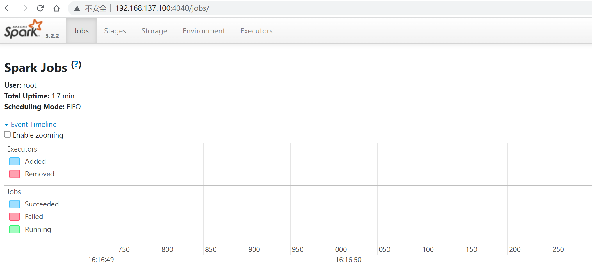
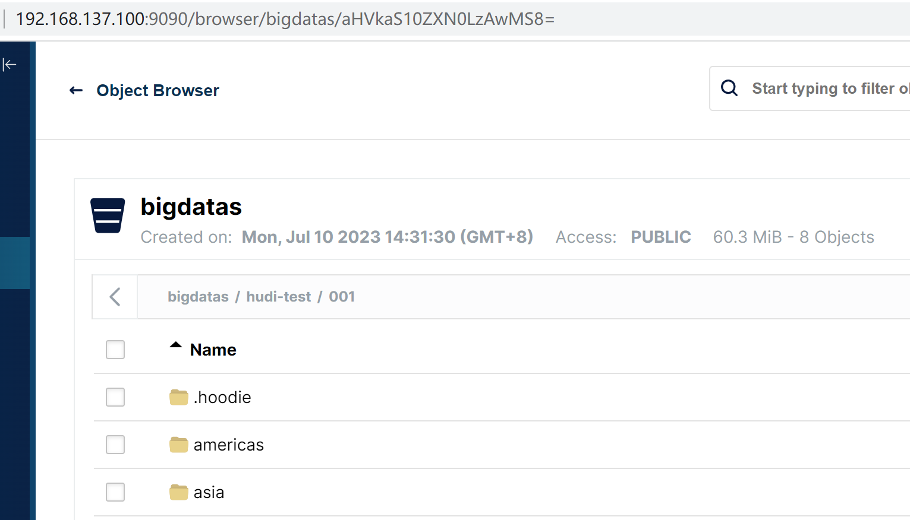
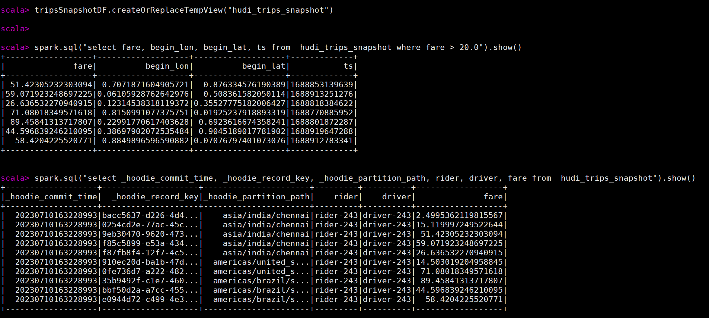
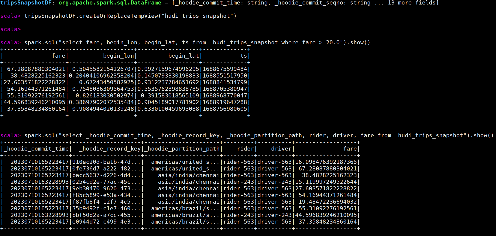

# Hudi与Spark结合

<aside>
💡 本指南总结Hudi基于spark-shell、spark-submit(java案例)，使用spark datasource来演示Hudi的操作Hudi表的插入、更新、读取快照和增量数据等功能。

</aside>

# 设置版本

Hudi与Spark-2.4.3和Spark 3.X版本。您可以按照此处的说明设置Spark。

**Spark 3 Support Matrix**

| Hudi | Supported Spark 3 version |
| --- | --- |
| 0.12.x | 3.3.x (default build), 3.2.x, 3.1.x |
| 0.11.x | 3.2.x (default build, Spark bundle only), 3.1.x |
| 0.10.x | 3.1.x (default build), 3.0.x |
| 0.7.0 - 0.9.0 | 3.0.x |
| 0.6.0 and prior | not supported |

默认的Build Spark版本表明它被用来构建Hudi-Spark3-Bundle。

当前本机测试版本：

- spark:3.2.2
- hudi:0.13.1

---

# Spark-Shell测试

测试hudi的读写功能，使用如：org.apache.hudi:hudi-spark3.3-bundle_2.12:0.13.1依赖包, 启动命令：

```bash
# Spark 3.2
spark-shell \
  --packages org.apache.hudi:hudi-spark3.2-bundle_2.12:0.13.1 \
  --conf 'spark.serializer=org.apache.spark.serializer.KryoSerializer' \
  --conf 'spark.sql.catalog.spark_catalog=org.apache.spark.sql.hudi.catalog.HoodieCatalog' \
  --conf 'spark.sql.extensions=org.apache.spark.sql.hudi.HoodieSparkSessionExtension'
```

上面命令因为packages参数是读取远程服务器可能下载比较慢，可以手动下载jar包：

[https://repo1.maven.org/maven2/org/apache/hudi/hudi-spark3.2-bundle_2.12/0.13.1/hudi-spark3.2-bundle_2.12-0.13.1.jar](https://repo1.maven.org/maven2/org/apache/hudi/hudi-spark3.2-bundle_2.12/0.13.1/hudi-spark3.2-bundle_2.12-0.13.1.jar) ， 存放到$SPARK_HOME/jars目录内 或者 MinIO中

之后，可以直接去除packages参数进入spark-shell控制台

```bash
[root@test001 spark-3.2.2-bin-hadoop3.2]# spark-shell \
--conf 'spark.serializer=org.apache.spark.serializer.KryoSerializer' \
--conf 'spark.sql.catalog.spark_catalog=org.apache.spark.sql.hudi.catalog.HoodieCatalog' \
--conf 'spark.sql.extensions=org.apache.spark.sql.hudi.HoodieSparkSessionExtension'
23/07/10 16:16:46 WARN Utils: Your hostname, test001 resolves to a loopback address: 127.0.0.1; using 192.168.137.100 instead (on interface eth0)
23/07/10 16:16:46 WARN Utils: Set SPARK_LOCAL_IP if you need to bind to another address
Setting default log level to "WARN".
To adjust logging level use sc.setLogLevel(newLevel). For SparkR, use setLogLevel(newLevel).
23/07/10 16:16:49 WARN NativeCodeLoader: Unable to load native-hadoop library for your platform... using builtin-java classes where applicable
23/07/10 16:16:50 WARN MetricsConfig: Cannot locate configuration: tried hadoop-metrics2-s3a-file-system.properties,hadoop-metrics2.properties
Spark context Web UI available at http://minio.local:4040
Spark context available as 'sc' (master = local[*], app id = local-1688977010380).
Spark session available as 'spark'.
Welcome to
      ____              __
     / __/__  ___ _____/ /__
    _\ \/ _ \/ _ `/ __/  '_/
   /___/ .__/\_,_/_/ /_/\_\   version 3.2.2
      /_/
         
Using Scala version 2.12.15 (Java HotSpot(TM) 64-Bit Server VM, Java 1.8.0_212)
Type in expressions to have them evaluated.
Type :help for more information.

scala>
```

其中，提示http://minio.local:4040,  说明访问当前IP:4040可以进入spark-history界面查看



## 表名设置

设置表名、基本路径和数据生成器以生成本指南的记录。

```scala
// spark-shell
import org.apache.hudi.QuickstartUtils._
import scala.collection.JavaConversions._
import org.apache.spark.sql.SaveMode._
import org.apache.hudi.DataSourceReadOptions._
import org.apache.hudi.DataSourceWriteOptions._
import org.apache.hudi.config.HoodieWriteConfig._
import org.apache.hudi.common.model.HoodieRecord

val tableName = "hudi_trips_cow"
val basePath = "s3a://bigdatas/hudi-test/001"
val dataGen = new DataGenerator
```

## 插入数据

scala插入代码：

```scala
// spark-shell
val inserts = convertToStringList(dataGen.generateInserts(10))
val df = spark.read.json(spark.sparkContext.parallelize(inserts, 2))
df.write.format("hudi").
  options(getQuickstartWriteConfigs).
  option(PRECOMBINE_FIELD_OPT_KEY, "ts").
  option(RECORDKEY_FIELD_OPT_KEY, "uuid").
  option(PARTITIONPATH_FIELD_OPT_KEY, "partitionpath").
  option(TABLE_NAME, tableName).
  mode(Overwrite).
  save(basePath)
```

执行情况：

```bash
scala> val inserts = convertToStringList(dataGen.generateInserts(10))
inserts: java.util.List[String] = [{"ts": 1688468894617, "uuid": "a7df5838-1139-4560-a024-4a1027dc596d", "rider": "rider-213", "driver": "driver-213", "begin_lat": 0.4726905879569653, "begin_lon": 0.46157858450465483, "end_lat": 0.754803407008858, "end_lon": 0.9671159942018241, "fare": 34.158284716382845, "partitionpath": "americas/brazil/sao_paulo"}, "partitionpath": "americas/brazil/sao_paulo"}, {"ts": 1688517421513, "uuid": "11282742-a2bb-4072-997b-462a329c5bc2", "rider": "rider-213", "driver": "driver-213", "begin_lat": 0.6100070562136587, "begin_lon": 0.8779402295427752, "end_lat": 0.3407870505929602, "end_lon": 0.5030798142293655, "fare": 43.4923811219014, "partitionpath": "americas/brazil/sao_paulo"}, "partitionpath": "americas/brazil/sao_paulo"}, {"ts":...

scala> val df = spark.read.json(spark.sparkContext.parallelize(inserts, 2))
warning: one deprecation (since 2.12.0)
warning: one deprecation (since 2.2.0)
warning: two deprecations in total; for details, enable `:setting -deprecation' or `:replay -deprecation'
df: org.apache.spark.sql.DataFrame = [begin_lat: double, begin_lon: double ... 8 more fields]

scala> df.write.format("hudi").
     |   options(getQuickstartWriteConfigs).
     |   option(PRECOMBINE_FIELD_OPT_KEY, "ts").
     |   option(RECORDKEY_FIELD_OPT_KEY, "uuid").
     |   option(PARTITIONPATH_FIELD_OPT_KEY, "partitionpath").
     |   option(TABLE_NAME, tableName).
     |   mode(Overwrite).
     |   save(basePath)
warning: one deprecation; for details, enable `:setting -deprecation' or `:replay -deprecation'
23/07/10 16:27:14 WARN DFSPropertiesConfiguration: Cannot find HUDI_CONF_DIR, please set it as the dir of hudi-defaults.conf
23/07/10 16:27:14 WARN DFSPropertiesConfiguration: Properties file file:/etc/hudi/conf/hudi-defaults.conf not found. Ignoring to load props file
23/07/10 16:27:15 WARN HiveConf: HiveConf of name hive.stats.jdbc.timeout does not exist
23/07/10 16:27:15 WARN HiveConf: HiveConf of name hive.stats.retries.wait does not exist
23/07/10 16:27:17 WARN ObjectStore: Version information not found in metastore. hive.metastore.schema.verification is not enabled so recording the schema version 2.3.0
23/07/10 16:27:17 WARN ObjectStore: setMetaStoreSchemaVersion called but recording version is disabled: version = 2.3.0, comment = Set by MetaStore root@127.0.0.1
23/07/10 16:27:17 WARN ObjectStore: Failed to get database default, returning NoSuchObjectException
23/07/10 16:27:18 WARN HoodieBackedTableMetadata: Metadata table was not found at path s3a://bigdatas/hudi-test/001/.hoodie/metadata
23/07/10 16:27:23 WARN MetricsConfig: Cannot locate configuration: tried hadoop-metrics2-hbase.properties,hadoop-metrics2.properties
```

之后，我们可以到MinIO查看是否生成hudi相关数据表文件：



说明此时，插入数据成功，其中

1. **`.hoodie`** 目录：
    - **`.hoodie`** 目录是 Hudi 表的元数据目录，用于存储 Hudi 表的元数据信息，包括表的配置、表的版本信息、全局文件索引、写入记录等。它是 Hudi 表的核心元数据目录，用于维护表的状态和一致性。
2. **`americas`** 目录：
    - **`americas`** 目录是 Hudi 表数据的存储目录之一。在 Hudi 中，表的数据通常被分区存储，每个分区对应一个目录。**`americas`** 目录可以表示一个分区，用于存储该分区的数据文件（例如 Parquet 文件）和索引文件。
3. **`asia`** 目录：
    - **`asia`** 目录是 Hudi 表数据的另一个存储目录，同样用于存储特定分区的数据文件和索引文件。与 **`americas`** 目录类似，**`asia`** 目录表示另一个分区

这些目录结构是 Hudi 在存储和管理表数据时的一种约定和组织方式。需要注意的是，**`.hoodie`** 目录和分区目录中的具体文件组织形式是由 Hudi 内部逻辑和文件命名规则决定的，对于用户而言，更重要的是使用 Hudi 提供的 API 和工具进行表的操作和数据读写。

---

## 查询数据

scala代码：

```scala
// spark-shell
val tripsSnapshotDF = spark.
  read.
  format("hudi").
  load(basePath)
tripsSnapshotDF.createOrReplaceTempView("hudi_trips_snapshot")

spark.sql("select fare, begin_lon, begin_lat, ts from  hudi_trips_snapshot where fare > 20.0").show()
spark.sql("select _hoodie_commit_time, _hoodie_record_key, _hoodie_partition_path, rider, driver, fare from  hudi_trips_snapshot").show()
```

执行效果图：



## 时间查询

```scala
spark.read.
  format("hudi").
  option("as.of.instant", "20210728141108100").
  load(basePath)

spark.read.
  format("hudi").
  option("as.of.instant", "2021-07-28 14:11:08.200").
  load(basePath)

// It is equal to "as.of.instant = 2021-07-28 00:00:00"
spark.read.
  format("hudi").
  option("as.of.instant", "2021-07-28").
  load(basePath)
```

## 更新数据

```scala
// spark-shell
val updates = convertToStringList(dataGen.generateUpdates(10))
val df = spark.read.json(spark.sparkContext.parallelize(updates, 2))
df.write.format("hudi").
  options(getQuickstartWriteConfigs).
  option(PRECOMBINE_FIELD_OPT_KEY, "ts").
  option(RECORDKEY_FIELD_OPT_KEY, "uuid").
  option(PARTITIONPATH_FIELD_OPT_KEY, "partitionpath").
  option(TABLE_NAME, tableName).
  mode(Append).
  save(basePath)
```

更新之后，重新查询，发现数据已改变（对比上面案例的第1次查询）



# 编译hudi的jar包使用

# hudi源码

[GitHub - apache/hudi: Upserts, Deletes And Incremental Processing on Big Data.](https://github.com/apache/hudi#building-apache-hudi-from-source)

下载0.13.1版本：[https://codeload.github.com/apache/hudi/zip/refs/tags/release-0.13.1](https://codeload.github.com/apache/hudi/zip/refs/tags/release-0.13.1)

```bash
# Checkout code and build
# git clone https://github.com/apache/hudi.git && cd hudi
wget [https://codeload.github.com/apache/hudi/zip/refs/tags/release-0.13.1](https://codeload.github.com/apache/hudi/zip/refs/tags/release-0.13.1)
cd hudi

mvn clean package -DskipTests -Dspark 3.2

cd /home/soft/
# 拷贝编译之后的packaging目录到/home/soft下
# Start command
spark-3.2.2-bin-hadoop3.2/bin/spark-shell \
  --jars `ls packaging/hudi-spark-bundle/target/hudi-spark3.2-bundle_2.12-*.jar` \
  --conf 'spark.serializer=org.apache.spark.serializer.KryoSerializer' \
  --conf 'spark.sql.extensions=org.apache.spark.sql.hudi.HoodieSparkSessionExtension' \
  --conf 'spark.sql.catalog.spark_catalog=org.apache.spark.sql.hudi.catalog.HoodieCatalog' \
  --conf 'spark.kryo.registrator=org.apache.spark.HoodieSparkKryoRegistrar'
```

之后，重复上面的scala代码：**表名设置 和 查询数据 部分代码执行，能查询到数据，说明编译的jar包正常。**

# 测试java

## hudi-examples-spark测试

```bash
# 基础依赖包
/home/soft/spark-3.2.2-bin-hadoop3.2/jars/hudi-spark3.2-bundle_2.12-0.13.1.jar
/home/soft/spark-3.2.2-bin-hadoop3.2/jars/hudi-examples-common-0.13.1.jar
# 演示案例
/home/soft/spark-3.2.2-bin-hadoop3.2/examples/jars/hudi-examples-spark-0.13.1.jar
```

```bash
spark-submit  \
--class org.apache.hudi.examples.spark.HoodieWriteClientExample \
--num-executors  2 \
/home/soft/spark-3.2.2-bin-hadoop3.2/examples/jars/hudi-examples-spark-0.13.1.jar s3a://tmp/hoodie/sample-table hoodie_rt
```

测试之后，可以看到在MinIO对应/tmp/hoodie/sample-table生成了hudi数据文件，此时可以使用spark-shell查看数据：

```bash
spark-shell \
--conf 'spark.serializer=org.apache.spark.serializer.KryoSerializer' \
--conf 'spark.sql.catalog.spark_catalog=org.apache.spark.sql.hudi.catalog.HoodieCatalog' \
--conf 'spark.sql.extensions=org.apache.spark.sql.hudi.HoodieSparkSessionExtension'
```

```scala
import org.apache.hudi.QuickstartUtils._
import scala.collection.JavaConversions._
import org.apache.spark.sql.SaveMode._
import org.apache.hudi.DataSourceReadOptions._
import org.apache.hudi.common.model.HoodieRecord

val tableName = "hoodie_rt"
val basePath = "s3a://tmp/hoodie/sample-table"
val dataGen = new DataGenerator

// spark-shell
val tripsSnapshotDF = spark.
  read.
  format("hudi").
  load(basePath)
tripsSnapshotDF.createOrReplaceTempView("hudi_trips_snapshot")

spark.sql("select fare, begin_lon, begin_lat, ts from  hudi_trips_snapshot where fare > 20.0").show()
spark.sql("select _hoodie_commit_time, _hoodie_record_key, _hoodie_partition_path, rider, driver, fare from  hudi_trips_snapshot").show(
```

```bash
# 输出结果
scala> spark.sql("select fare, begin_lon, begin_lat, ts from  hudi_trips_snapshot where fare > 20.0").show()
+-----------------+------------------+------------------+---+
|             fare|         begin_lon|         begin_lat| ts|
+-----------------+------------------+------------------+---+
|38.63372961020515|0.9065078444936647|0.6662084366450246|  0|
|81.37564420028626| 0.964603455586492|0.4106290929046368|  0|
+-----------------+------------------+------------------+---+

scala> spark.sql("select _hoodie_commit_time, _hoodie_record_key, _hoodie_partition_path, rider, driver, fare from  hudi_trips_snapshot").show()
+-------------------+--------------------+----------------------+--------------------+--------------------+------------------+
|_hoodie_commit_time|  _hoodie_record_key|_hoodie_partition_path|               rider|              driver|              fare|
+-------------------+--------------------+----------------------+--------------------+--------------------+------------------+
|  20230711104948033|891c8a94-0d4f-4fb...|            2020/01/02|rider-20230711104...|driver-2023071110...| 38.63372961020515|
|  20230711104948033|6bb11672-28a3-42a...|            2020/01/02|rider-20230711104...|driver-2023071110...| 81.37564420028626|
|  20230711104948033|95805aaf-9024-452...|            2020/01/01|rider-20230711104...|driver-2023071110...|12.153670568058683|
+-------------------+--------------------+----------------------+--------------------+--------------------+------------------+
```

## hudi-examples-spark修改

在官方提供的HoodieWriteClientExample 这个案例中，没有数据的读取，这里可以尝试修改添加：

```bash
// 补充打印表结构
SparkSession sparkSession = HoodieExampleSparkUtils.defaultSparkSession("hoodie-client-example");
Dataset<Row> tripsSnapshotDF  = sparkSession.read().format("hudi").load(tablePath);
tripsSnapshotDF.createOrReplaceTempView("hudi_trips_snapshot");

// Query trips with fare greater than 20.0
sparkSession.sql("select fare, begin_lon, begin_lat, ts from hudi_trips_snapshot where fare > 20.0").show();

// Query all trips data
sparkSession.sql("select _hoodie_commit_time, _hoodie_record_key, _hoodie_partition_path, rider, driver, fare from hudi_trips_snapshot").show();
client.close();
```

重新编译执行：

```bash
# 切换到下面文件夹
hudi-release-0.13.1\hudi-examples\hudi-examples-spark
# 执行
mvn clean package -DskipTests
```

之后重新执行spark-submit，可以看到最后会在控制台输出：

```bash
23/07/11 11:26:26 INFO DAGScheduler: Job 79 finished: show at HoodieWriteClientExampleTest.java:157, took 0.040572 s
23/07/11 11:26:26 INFO CodeGenerator: Code generated in 16.207392 ms
+-----------------+------------------+------------------+---+
|             fare|         begin_lon|         begin_lat| ts|
+-----------------+------------------+------------------+---+
|38.63372961020515|0.9065078444936647|0.6662084366450246|  0|
|81.37564420028626| 0.964603455586492|0.4106290929046368|  0|
|81.37564420028626| 0.964603455586492|0.4106290929046368|  0|
|38.63372961020515|0.9065078444936647|0.6662084366450246|  0|
+-----------------+------------------+------------------+---+

23/07/11 11:26:26 INFO FileSourceStrategy: Pushed Filters: 
23/07/11 11:26:26 INFO FileSourceStrategy: Post-Scan Filters:
...
23/07/11 11:26:26 INFO CodeGenerator: Code generated in 16.549209 ms
+-------------------+--------------------+----------------------+--------------------+--------------------+------------------+
|_hoodie_commit_time|  _hoodie_record_key|_hoodie_partition_path|               rider|              driver|              fare|
+-------------------+--------------------+----------------------+--------------------+--------------------+------------------+
|  20230711104948033|891c8a94-0d4f-4fb...|            2020/01/02|rider-20230711104...|driver-2023071110...| 38.63372961020515|
|  20230711104948033|6bb11672-28a3-42a...|            2020/01/02|rider-20230711104...|driver-2023071110...| 81.37564420028626|
|  20230711112614582|a83cc302-7512-486...|            2020/01/02|rider-20230711112...|driver-2023071111...| 81.37564420028626|
|  20230711112614582|50474432-358f-4ee...|            2020/01/02|rider-20230711112...|driver-2023071111...| 38.63372961020515|
|  20230711104948033|95805aaf-9024-452...|            2020/01/01|rider-20230711104...|driver-2023071110...|12.153670568058683|
|  20230711112614582|64343243-6765-427...|            2020/01/01|rider-20230711112...|driver-2023071111...|12.153670568058683|
+-------------------+--------------------+----------------------+--------------------+--------------------+------------------+

23/07/11 11:26:26 INFO BaseHoodieClient: Stopping Timeline service !!
23/07/11 11:26:26 INFO EmbeddedTimelineService: Closing Timeline server
23/07/11 11:26:26 INFO TimelineService: Closing Timeline Service
....
```

# Spark-Operator结合使用
```yaml
apiVersion: "sparkoperator.k8s.io/v1beta2"
kind: SparkApplication
metadata:
  name: hudi-spark-071204
  namespace: spark
spec:
  type: Scala
  mode: cluster
  image: "umr/spark:3.2.2_v2"
  imagePullPolicy: IfNotPresent
  mainClass: org.apache.hudi.examples.spark.HoodieWriteClientExampleTest
  arguments:
    - "s3a://bigdatas/datas/sample-table"
    - "hoodie_rt"
  mainApplicationFile: "s3a://bigdatas/jars/hudi-examples-spark-0.13.1-0704.jar"
  sparkVersion: "3.2.2"
  timeToLiveSeconds: 259200
  restartPolicy:
    type: Never
  volumes:
    - name: "test-volume"
      hostPath:
        path: "/tmp"
        type: Directory
  driver:
    cores: 1
    coreLimit: "1200m"
    memory: "512m"
    labels:
      version: 3.2.2
    serviceAccount: spark
    volumeMounts:
      - name: "test-volume"
        mountPath: "/tmp"
  executor:
    cores: 1
    instances: 1
    memory: "512m"
    labels:
      version: 3.2.2
    volumeMounts:
      - name: "test-volume"
        mountPath: "/tmp"
  sparkConf:
    spark.ui.port: "4045"
    spark.eventLog.enabled: "true"
    spark.eventLog.dir: "s3a://sparklogs/all"
    spark.hadoop.fs.s3a.access.key: "minio"
    spark.hadoop.fs.s3a.secret.key: "minio123"
    spark.hadoop.fs.s3a.impl: "org.apache.hadoop.fs.s3a.S3AFileSystem"
    spark.hadoop.fs.s3a.endpoint: "http://10.19.64.205:32000"
    spark.hadoop.fs.s3a.connection.ssl.enabled: "false"
    spark.hadoop.fs.s3a.path.style.access: "true"
    spark.hadoop.fs.s3a.aws.credentials.provider: "org.apache.hadoop.fs.s3a.SimpleAWSCredentialsProvider"
    spark.jars: "s3a://bigdatas/jars/hudi-spark3.2-bundle_2.12-0.13.1.jar, s3a://bigdatas/jars/hudi-examples-common-0.13.1.jar"
```

# hudi与云原生

Hudi（Hadoop Upserts Deletes and Incrementals）在云原生环境下使用具有以下优势：

1. 弹性和可扩展性：云原生环境提供了弹性和可扩展性，使得在处理大规模数据和高并发工作负载时更加灵活和高效。Hudi 可以根据需要自动调整资源，以适应不断变化的工作负载需求。
2. 弹性存储：在云原生环境中，您可以使用云存储服务（如 Amazon S3、Azure Blob Storage、Google Cloud Storage）作为 Hudi 表的底层存储。这些云存储服务具有高可靠性、可扩展性和持久性，并且能够按需存储和访问数据。
3. 弹性计算：云原生环境提供了弹性计算资源，如云服务器和容器服务（如 Amazon EC2、Azure VM、Kubernetes）。使用 Hudi 在云原生环境中，您可以根据工作负载的需求快速启动和停止计算资源，以实现高效的数据处理和分析。
4. 容器化支持：云原生环境通常使用容器技术，如 Docker 和 Kubernetes，来管理应用程序和资源。Hudi 提供了与容器技术的良好集成，可以轻松部署和管理 Hudi 应用程序，并实现弹性伸缩和故障恢复。
5. 与云服务集成：云原生环境提供了丰富的云服务和工具，如监控、日志、身份认证、密钥管理等。Hudi 可以与这些云服务进行集成，以实现全面的数据管控和操作。
6. 与其他云原生工具的配合：Hudi 可以与其他云原生工具和技术栈（如 Apache Kafka、Apache Flink、Apache Airflow）进行集成，构建端到端的数据处理和分析流水线，从数据摄取到数据湖存储、批处理和实时处理等。

总体而言，将 Hudi 部署在云原生环境中，可以充分利用云计算和云存储的优势，提供弹性、可扩展和高效的数据管理和处理能力，为大规模数据工作负载提供更好的性能和可靠性。

# 参考：

[Spark Guide | Apache Hudi](https://hudi.apache.org/docs/quick-start-guide)