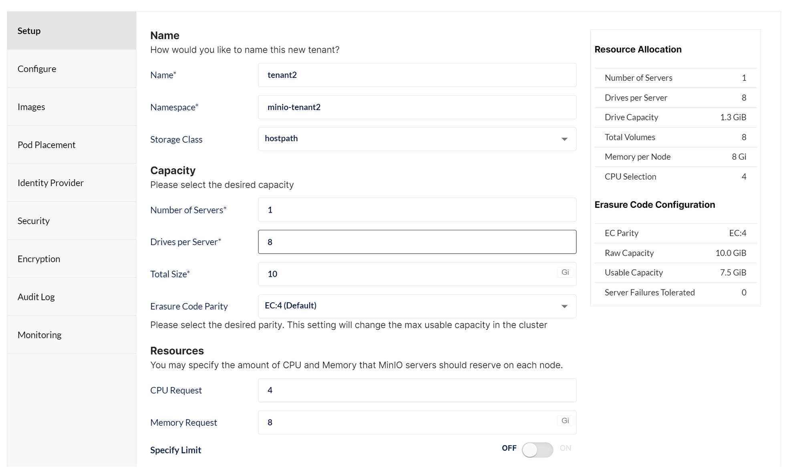
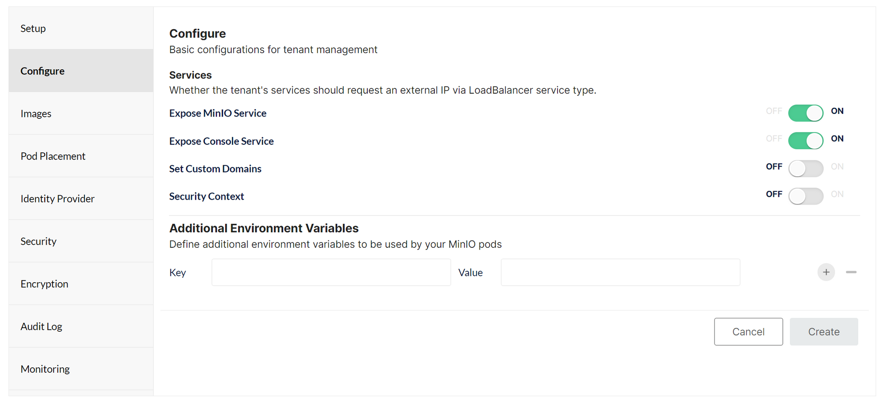
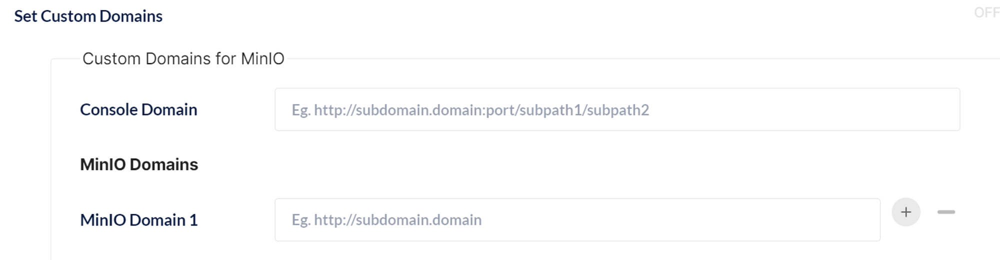
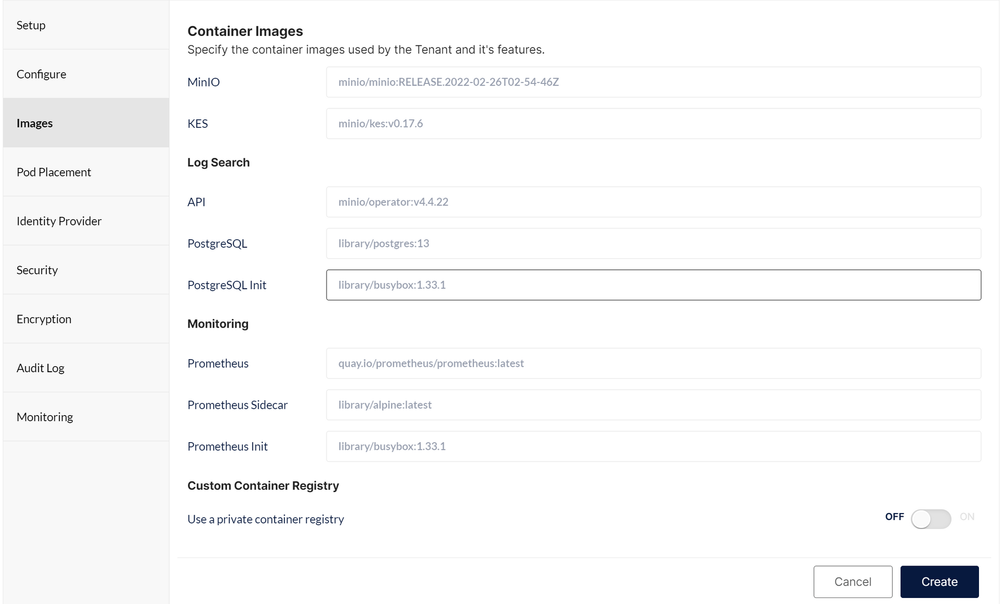
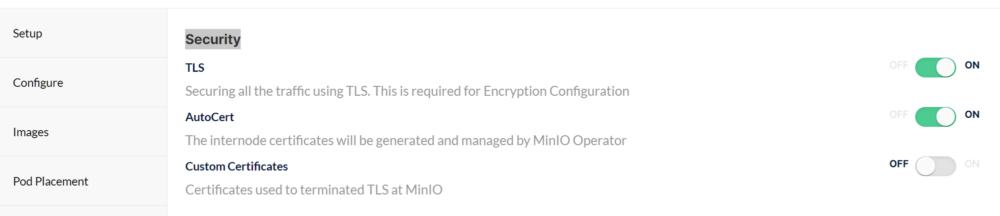
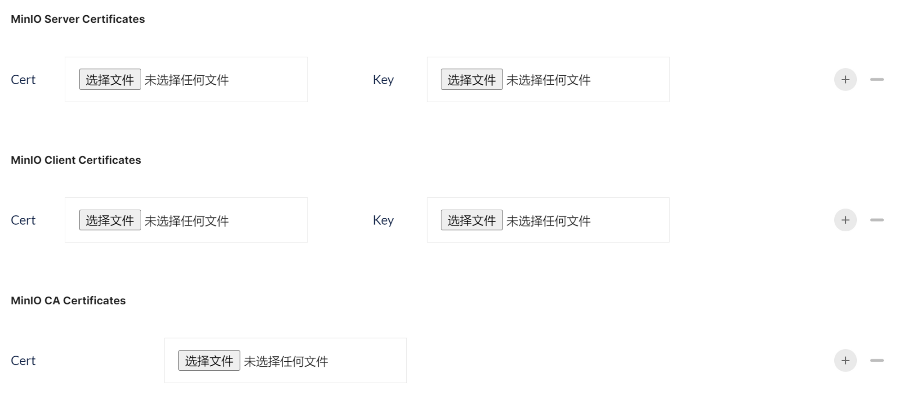
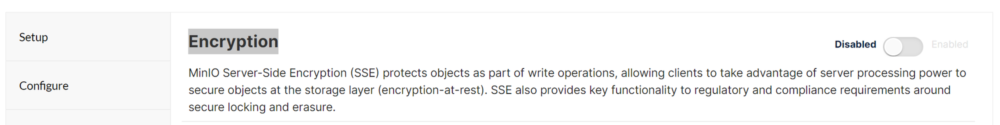
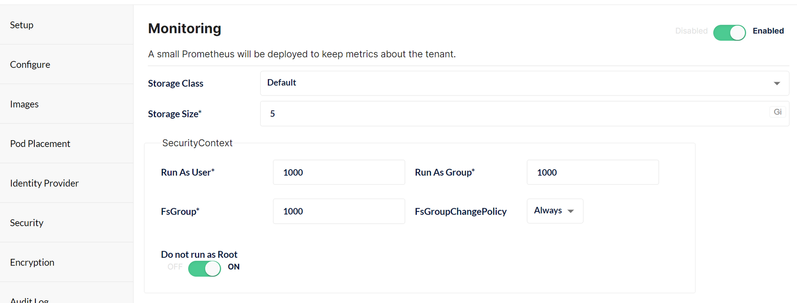

<aside>
💡 minio operator的安装记录
</aside>

[Deploy the MinIO Operator](https://min.io/docs/minio/kubernetes/upstream/operations/installation.html)

# 一、基于官网说明

## 1. 安装MinIO Kubernetes插

```bash
curl https://github.com/minio/operator/releases/download/v4.5.8/kubectl-minio_4.5.8_linux_amd64 -o kubectl-minio
chmod +x kubectl-minio
mv kubectl-minio /usr/local/bin/
kubectl minio version
# 当前版本4.5.8
```

## 2. 初始化MinIO Kubernetes Operator

```bash
# 默认安装到minio-operator这个命名空间中
kubectl minio init
```

## 3. 验证安装是否成功

```bash
$ kubectl get all --namespace minio-operator
NAME                                  READY   STATUS    RESTARTS   AGE
pod/console-57b67f8586-gfj8c          1/1     Running   0          3m42s
pod/minio-operator-799959d9b8-bq8cr   1/1     Running   0          3m43s
pod/minio-operator-799959d9b8-kffzp   0/1     Pending   0          3m43s

NAME               TYPE        CLUSTER-IP      EXTERNAL-IP   PORT(S)             AGE
service/console    ClusterIP   10.43.106.146   <none>        9090/TCP,9443/TCP   3m42s
service/operator   ClusterIP   10.43.221.221   <none>        4222/TCP,4221/TCP   3m43s

NAME                             READY   UP-TO-DATE   AVAILABLE   AGE
deployment.apps/console          1/1     1            1           3m42s
deployment.apps/minio-operator   1/2     2            1           3m43s

NAME                                        DESIRED   CURRENT   READY   AGE
replicaset.apps/console-57b67f8586          1         1         1       3m42s
replicaset.apps/minio-operator-799959d9b8   2         2         1       3m43s
```

## 4.打开控制台UI

```bash
kubectl minio proxy
```

# 二、使用helm包安装

## 1.控制台预览

```bash
# helm包来自： https://codeload.github.com/minio/operator/zip/refs/tags/v4.5.8 里面helm-releases目录operator-4.5.8.tgz

helm install minio-operator ./operator-4.5.8.tgz --namespace minio-operator --dry-run --debug

# 更新value.yaml ，如开启ingress
helm upgrade -f value.yaml minio-operator -n minio-operator ./operator-4.5.8.tgz

```

## 2. 安装创建secret、获取JWT

```bash
# Get the JWT for logging in to the console:
kubectl apply -f - <<EOF
apiVersion: v1
kind: Secret
metadata:
  name: console-sa-secret
  namespace: minio-operator
  annotations:
    kubernetes.io/service-account.name: console-sa
type: kubernetes.io/service-account-token
EOF

kubectl -n minio-operator  get secret console-sa-secret -o jsonpath="{.data.token}" | base64 --decode
```

## 3.暴露端口9090或修改NodePort

```bash
# Get the Operator Console URL by running these commands:
  kubectl --namespace minio-operator port-forward svc/console 9090:9090
  echo "Visit the Operator Console at http://127.0.0.1:9090"
```

也可以编辑service/console，修改service的type为NodePort类型

## 4. minio-operator相关服务查看

```bash
chq@chq:~/minio-test$ kubectl get all -n minio-operator
NAME                                  READY   STATUS    RESTARTS   AGE
pod/console-668bcdfd64-lcjtm          1/1     Running   0          19h
pod/minio-operator-5bddd7865f-rrz4z   1/1     Running   0          19h
pod/minio-operator-5bddd7865f-zmnvn   1/1     Running   0          19h

NAME               TYPE        CLUSTER-IP       EXTERNAL-IP   PORT(S)                         AGE
service/console    NodePort    10.96.61.238     <none>        9090:32365/TCP,9443:30724/TCP   19h
service/operator   ClusterIP   10.100.131.148   <none>        4222/TCP                        19h

NAME                             READY   UP-TO-DATE   AVAILABLE   AGE
deployment.apps/console          1/1     1            1           19h
deployment.apps/minio-operator   2/2     2            2           19h

NAME                                        DESIRED   CURRENT   READY   AGE
replicaset.apps/console-668bcdfd64          1         1         1       19h
replicaset.apps/minio-operator-5bddd7865f   2         2         2       19h
```

```bash
chq@chq:~/minio-test$ kubectl get secret -n minio-operator
NAME                                   TYPE                                  DATA   AGE
console-sa-secret                      kubernetes.io/service-account-token   3      19h
operator-tls                           Opaque                                2      19h
sh.helm.release.v1.minio-operator.v1   helm.sh/release.v1                    1      19h
```

```bash
chq@chq:~/minio-test$ kubectl get cm -n minio-operator
NAME               DATA   AGE
console-env        2      19h
kube-root-ca.crt   1      19h
```

```bash
chq@chq:~/minio-test$ kubectl get role,roleBinding,sa -n minio-operator
NAME                            SECRETS   AGE
serviceaccount/console-sa       0         19h
serviceaccount/default          0         19h
serviceaccount/minio-operator   0         19h
```

## 5.租户相关服务查看

```bash
chq@chq:~/minio-test$ kubectl get all -n minio-tenant1
NAME                                          READY   STATUS    RESTARTS      AGE
pod/tenant1-log-0                             1/1     Running   0             73s
pod/tenant1-log-search-api-7dd9d759cd-hzxgg   1/1     Running   3 (54s ago)   72s
pod/tenant1-pool-0-0                          1/1     Running   0             74s

NAME                             TYPE           CLUSTER-IP      EXTERNAL-IP   PORT(S)          AGE
service/minio                    LoadBalancer   10.104.161.19   localhost     443:31360/TCP    2m14s
service/tenant1-console          LoadBalancer   10.104.4.134    localhost     9443:32591/TCP   2m14s
service/tenant1-hl               ClusterIP      None            <none>        9000/TCP         2m14s
service/tenant1-log-hl-svc       ClusterIP      None            <none>        5432/TCP         73s
service/tenant1-log-search-api   ClusterIP      10.97.138.211   <none>        8080/TCP         72s

NAME                                     READY   UP-TO-DATE   AVAILABLE   AGE
deployment.apps/tenant1-log-search-api   1/1     1            1           72s

NAME                                                DESIRED   CURRENT   READY   AGE
replicaset.apps/tenant1-log-search-api-7dd9d759cd   1         1         1       72s

NAME                              READY   AGE
statefulset.apps/tenant1-log      1/1     73s
statefulset.apps/tenant1-pool-0   1/1     74s
```

```bash
chq@chq:~/minio-test$ kubectl get secret -n minio-tenant1
NAME                        TYPE     DATA   AGE
operator-tls                Opaque   1      91m
operator-webhook-secret     Opaque   3      92m
tenant1-env-configuration   Opaque   1      92m
tenant1-log-secret          Opaque   4      90m
tenant1-secret              Opaque   2      92m
tenant1-tls                 Opaque   2      91m
tenant1-user-0              Opaque   2      92m

chq@chq:~/minio-test$ kubectl get cm -n minio-tenant1
NAME               DATA   AGE
kube-root-ca.crt   1      43h

chq@chq:~/minio-test$ kubectl get role,roleBinding,sa -n minio-tenant1
NAME                     SECRETS   AGE
serviceaccount/default   0         43h
```

# 三、租户创建

## Setup 安装(重点)



参数说明：

- Name：租户名称
- Namespace：租户命名空间，每个命名空间只能有一个租户
- Storage Class:  默认存储类
- Number of Servers:  对应租户的statefulset副本数
- Driver per Server：硬盘总数
- Total Size: 总共可存储容量，最小为 1GB * 硬盘总数
- Erasure Code Parity: 擦除码奇偶校验，不能高于N/2(N为硬盘总数)

## Configure 租户管理的基本配置



- Services： 租户的服务是否应通过LoadBalancer服务类型请求外部IP。
- Expose MinIO Service:  暴露MinIO服务
- Expose Console Service:  暴露Console服务
- Set Custom Domains:  自定义域名，一般不开启



- 


- **Additional Environment Variables： 其他环境变量设置**

## Images 镜像相关



## Pod Placement  Pod亲和性相关


## Identity Provider 身份提供者


## Security



- TLS：使用TLS保护所有流量。这是加密配置所必需的
- AotoCert: 节点间证书将由MinIO运营商生成和管理
- Custom Certificates: 自定义证书，默认不启用



## **Encryption 加密**



MinIO服务器端加密 (SSE) 作为写入操作的一部分来保护对象，从而允许客户端利用服务器处理能力来保护存储层中的对象 (静态加密)。SSE还提供了有关安全锁定和擦除的法规和合规性要求的关键功能。

## **Audit Log 审计日志**


部署一个小型PostgreSQL数据库，并将所有调用的访问日志存储到租户中。

- Log Search Storage Class： 存储类
- Storage Size:  存储最大容量
- SecurityContext for LogSearch：安全环境
- SecurityContext for PostgreSQL：安全环境

## **Monitoring 监控**



将部署一个小型普罗米修斯，以保留有关租户的指标。

# 遇到问题
### 1. 多租户的时候，通过暴露LoadBalancer的方式会产生冲突

```bash
# 租户1：
chq@chq:~/minio-test$ kubectl get svc -n minio-tenant1
NAME                     TYPE           CLUSTER-IP      EXTERNAL-IP   PORT(S)          AGE
minio                    LoadBalancer   10.104.161.19   localhost     443:31360/TCP    99m
tenant1-console          LoadBalancer   10.104.4.134    localhost     9443:32591/TCP   99m
tenant1-hl               ClusterIP      None            <none>        9000/TCP         99m
tenant1-log-hl-svc       ClusterIP      None            <none>        5432/TCP         98m
tenant1-log-search-api   ClusterIP      10.97.138.211   <none>        8080/TCP         98m

# 租户2：
chq@chq:~/minio-test$ kubectl get svc -n minio-tenant2
NAME                        TYPE           CLUSTER-IP       EXTERNAL-IP   PORT(S)          AGE
minio                       LoadBalancer   10.105.171.222   <pending>     443:32226/TCP    20m
tenant2-console             LoadBalancer   10.110.135.63    <pending>     9443:30786/TCP   20m
tenant2-hl                  ClusterIP      None             <none>        9000/TCP         20m
tenant2-log-hl-svc          ClusterIP      None             <none>        5432/TCP         19m
tenant2-log-search-api      ClusterIP      10.97.121.36     <none>        8080/TCP         19m
tenant2-prometheus-hl-svc   ClusterIP      None             <none>        9090/TCP         3m47s
```

上面服务tenant1-console、tenant2-console都占用9443端口，导致访问localhost:9443只指向tenant1-console，而tenant2-console没有生效需要修改（有问题，会隔几分钟自动又变回9443端口）：

```bash
apiVersion: v1
kind: Service
metadata:
  creationTimestamp: "2023-03-29T02:53:52Z"
  name: tenant2-console
  namespace: minio-tenant2
	....
  ports:
  - name: https-console
    nodePort: 30786
    port: 29443        # 原值为9443，这里修改为29443
    protocol: TCP
    targetPort: 9443
  selector:
    v1.min.io/tenant: tenant2
```

最终解决办法：安装minio-operator的时候配置ingress（注意kubernetes环境已经安装了[ingress-nginx](https://kubernetes.github.io/ingress-nginx/deploy/)）

```bash
# value.yaml
....
ingress:
    enabled: true
    ingressClassName: "nginx"
    labels: { }
    annotations: { }
    tls: [ ]
    host: console.local
    path: /
    pathType: Prefix
....

# 安装
# --dry-run --debug
helm install minio-operator ./operator-4.5.8.tgz --namespace minio-operator --set ingress.enabled=true --set ingress.ingressClassName=nginx

# 更新（假如已经安装了）
helm upgrade -f value.yaml minio-operator -n minio-operator ./operator-4.5.8.tgz
```
